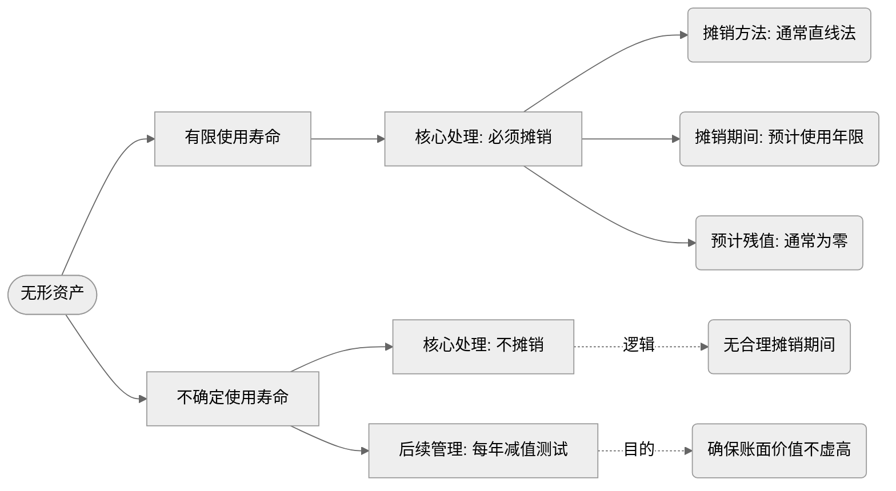

![[附件/第3关-后续计量与终止确认信息图-16x9.svg]]

第2关我们把四类资产的初始确认讲完了。资产进了账，故事并没有结束。

持有期间，资产的价值在变化；使用过程中，资产的价值在消耗；最终处置的时候，资产要离开账簿。这一关，我们把存货、固定资产、无形资产这三类资产的完整生命周期走完——**后续计量和终止确认**。

投资性房地产因为有两种计量模式以及模式之间的转换问题，逻辑相对独立，下一关单独展开。

---

## 一、引子：流动性，一条贯穿全关的逻辑线

在进入具体资产之前，先建立一个认知框架。

存货是流动资产，固定资产和无形资产是非流动资产。这个分类不只是资产负债表上的位置差异，它背后反映的是两类资产**价值实现方式的根本不同**，并由此决定了后续计量的一系列处理差异。

**流动资产通过"卖出"实现价值。**

存货的使命是卖掉。它的价值在卖出的那一刻转化为收入，对应的成本在那一刻进入损益。持有期间，存货的价值没有被"消耗"，只是在等待变现。所以存货不需要折旧——没有渐进消耗的过程，自然不需要模拟这个过程的会计处理。

**非流动资产通过"用"实现价值。**

固定资产和无形资产的使命是用来生产或提供服务。它们的价值通过使用过程渐进地转移到产品或服务中，这个消耗过程是持续的、跨期的。折旧和摊销，就是在用会计的方式模拟这个渐进消耗——**把资产的成本，按照它贡献价值的节奏，系统地分配到各个受益期间。**

这条流动性逻辑，不只解释了折旧摊销的有无，还决定了**减值能不能转回**——这是这一关最重要的一个分叉口，我们在后面会详细展开。

记住这条线：**流动性强弱，决定价值观察的客观程度，进而决定会计处理的逻辑。**

---

## 二、存货的后续计量与终止确认

### 持有期间：期末计量——成本与可变现净值孰低

> 资产负债表日，存货按照**成本与可变现净值孰低**计量。

> [!note]
>
> - **可变现净值的确定**：
>   - **直接用于出售的存货**（如库存商品）：可变现净值 = 估计售价 - 估计销售费用及相关税费。
>   - **需要加工的材料存货**：
>     - 若终端产品未减值：材料按成本计量，不计提准备。
>     - 若终端产品已减值：材料可变现净值 = 终端产品估计售价 - 至完工时估计将要发生的成本 - 估计销售费用及相关税费。

**存货售价的确定**：
![[21-会计/2-逻辑重构100关/附件/Pasted image 20260428103111.png]]

简单说：**这批货，你最多能从市场上换回来多少净额。**

如果账面成本低于可变现净值——正常，不做处理，按历史成本列示。

如果账面成本高于可变现净值——说明账面有虚高，要计提**存货跌价准备**，把多余的部分减下来。

```
借：资产减值损失 
贷：存货跌价准备
```

> [!example] 例题·单选题
> 2×24年11月1日，甲公司首次购买新产品专用原材料20吨，采购总成本100万元；2×24年11月30日，再次购买该专用原材料30吨，采购总成本135万元；2×24年12月，甲公司为生产新产品消耗该原材料10吨。甲公司生产每吨新产品除需消耗1吨该原材料外，还需额外发生的生产成本为1.1万元；为销售每吨新产品平均所需费用为0.2万元。2×24年12月31日，新产品的市场价格为每吨5.5万元。甲公司采用移动加权平均法对发出原材料进行计量，该原材料仅为生产新产品使用。不考虑相关税费及其他因素，2×24年末甲公司对该库存原材料计提的存货跌价准备是(   )。
>
> A. 20万元
>
> B. 17万元
>
> C. 9万元
>
> D. 32万元
>
> > [!check]- 答案与解析
> >
> > **正确答案：A**
> >
> > **深度解析：**
> > **第一步：计算原材料单位成本。** 采用移动加权平均法，原材料每吨成本为 $(100+135) \div (20+30) = 4.7$ （万元/吨）。
> > **第二步：判断产品是否减值。** 新产品的单位可变现净值 $= 5.5 - 0.2 = 5.3$ （万元/吨）；产品的单位成本 $= 4.7 + 1.1 = 5.8$ （万元/吨）。由于产品成本 $5.8 > 5.3$ 可变现净值，表明产品已发生减值。
> > **第三步：计算原材料的可变现净值。** 原材料专门用于生产产品，且产品已减值，故原材料应按可变现净值计量。原材料的可变现净值 $= 5.5 - 1.1 - 0.2 = 4.2$ （万元/吨）。
> > **第四步：计算跌价准备。** 期末库存原材料数量 $= 20 + 30 - 10 = 40$ （吨）。应计提的存货跌价准备 $= (4.7 - 4.2) \times 40 = 20$ （万元），对应选项A。
> >
> > **💡 易错点提示：**
> > 切勿直接以原材料市场价格或产品售价为基础计算。需牢记：**用于生产产品的原材料，其可变现净值应以所产产品的售价为基础，减去至完工时估计将要发生的成本及销售费用**，而非原材料本身的市价。

---

### 存货跌价准备可以转回——为什么？

这里有一个重要的问题：如果下一期市场回暖，可变现净值重新高于账面成本了，之前计提的跌价准备可以转回吗？

**可以。**

原因是：存货是流动资产，流动性强，市场上有大量同类商品在交易，可变现净值是可以直接观察到的客观市价，不依赖主观估计。市价跌了如实记录，市价回来了如实恢复，这是对现实的真实反映，转回是合理的。

但转回有一个上限：**转回后的账面价值，不能超过原来的历史成本。**

---

### 终止确认：存货的结转

存货的终止确认很简单——卖出去的时候，按照成本结转：

```
借：主营业务成本 / 其他业务成本
    存货跌价准备
    贷：库存商品 / 原材料等
```

关于发出价格，则取决于公司的会计政策：

1. 先进先出法
2. 移动加权平均法
3. 月末一次加权平均法
4. 个别计价法

> [!example] 真题·单选题
> 甲公司为增值税一般纳税人，适用的增值税税率为13%，发出存货采用加权平均法计量，2×23年发生的交易或事项如下：(1)1月购入M原材料**200件**，不含增值税价格**1000万元**，M原材料月初余额为0；(2)3月购入M原材料**300件**，不含增值税价格**1200万元**；(3)4月生产领用M原材料**200件**；(4)5月将**100件**M原材料作为福利发放给管理人员；(5)6月将剩余M原材料全部投入用于生产应税产品的在建生产线。不考虑除增值税以外相关税费及其他因素，甲公司应计入在建工程成本的M原材料的金额是(   )。(2025年回忆版)
>
> A. **937.2**万元
>
> B. **880**万元
>
> C. **800**万元
>
> D. **994.4**万元
>
> > [!check]- 答案与解析
> >
> > **正确答案：B**
> >
> > **深度解析：**
> > **第一步：计算单位成本**\
> > 采用**加权平均法**，总成本 = **1000 + 1200 = 2200**万元，总数量 = **200 + 300 = 500**件\
> > 单位成本 = $\frac{2200}{500} = 4.4$ (**万元/件**)
> >
> > **第二步：计算剩余原材料数量**\
> > 总入库 = **500**件\
> > 生产领用 = **200**件（计入**产品成本**）\
> > 福利发放 = **100**件（计入**管理费用**）\
> > 剩余 = $500 - 200 - 100 = 200$件（用于**在建工程**）
> >
> > **第三步：计算在建工程成本**\
> > 金额 = $4.4 \times 200 = 880$万元
> >
> > **💡 易错点提示：**\
> > **生产领用**的原材料计入**产品成本**，**福利发放**计入**管理费用**，仅用于**应税产品在建生产线**的剩余原材料计入**在建工程**。

---

## 三、固定资产的后续计量与终止确认

### 折旧：价值消耗的会计模拟

固定资产通过使用来实现价值，折旧是把固定资产的成本系统地分配到各受益期间的过程。

折旧的计算，取决于三个要素：**折旧基数、折旧年限、折旧方法。**

**折旧基数**：通常是固定资产的原值减去预计净残值。净残值是资产使用寿命结束后预计能收回的残余价值。不是所有资产都有净残值，但只要有，就要从折旧基数里扣掉。

**折旧年限**：资产的预计使用寿命，由企业根据资产的性质和使用情况估计，不是固定的。税法有规定的最低年限，但会计上可以根据实际情况判断。

**折旧方法**：常见的有四种——

| 对比维度        | 年限平均法（直线法）                           | 工作量法                                                         | 双倍余额递减法                                                          | 年数总和法                                                         |
| ----------- | ------------------------------------ | ------------------------------------------------------------ | ---------------------------------------------------------------- | ------------------------------------------------------------- |
| **计算公式**    | 年折旧额 = (原值 - 预计净残值) ÷ 预计使用年限         | 单位工作量折旧额 = (原值 - 预计净残值) ÷ 预计总工作量<br>某期折旧额 = 当期工作量 × 单位工作量折旧额 | 年折旧率 = 2 ÷ 预计使用年限 × 100%<br>年折旧额 = 期初账面净值 × 年折旧率<br>**最后两年改直线法** | 年折旧率 = 尚可使用年限 ÷ 预计使用年限总和 × 100%<br>年折旧额 = (原值 - 预计净残值) × 年折旧率 |
| **折旧特点**    | 每期折旧额相等                              | 与实际使用量挂钩                                                     | 前期多，后期少<br>加速折旧                                                  | 前期多，后期少<br>加速折旧                                               |
| **方法分类**    | 平均年限法                                | 变动折旧法                                                        | 加速折旧法                                                            | 加速折旧法                                                         |
| **是否考虑净残值** | ✅ 扣除净残值                              | ✅ 扣除净残值                                                      | ⚠️ 前期不扣，最后两年扣                                                    | ✅ 扣除净残值                                                       |
| **适用场景**    | • 使用程度均衡的固定资产<br>• 房屋、建筑物<br>• 使用最广泛 | • 运输工具（按里程）<br>• 大型设备（按工时）<br>• 使用不均衡的资产                     | • 技术更新快的设备<br>• 电子设备、计算机<br>• 需快速收回投资的资产                         | • 技术更新较快的设备<br>• 需加速折旧的资产<br>• 与双倍余额递减法类似                     |
| **税收优惠**    | 常规折旧                                 | 常规折旧                                                         | 可享受加速折旧优惠                                                        | 可享受加速折旧优惠                                                     |

---

### 固定资产减值：计提之后不能转回

固定资产在资产负债表日，如果有迹象表明可能发生减值，需要进行减值测试。

减值测试的核心：比较资产的**账面价值**与**可收回金额**。

可收回金额 = Max（公允价值减处置费用，使用价值）

如果账面价值 > 可收回金额，计提减值损失：

```
借：资产减值损失 
贷：固定资产减值准备
```

**固定资产减值准备，计提之后不能转回。**

固定资产流动性差，市场上没有活跃交易，它的可收回金额——无论是公允价值还是使用价值——都依赖大量的主观估计，可靠性有限。如果允许转回，企业可以操纵减值的计提和转回来调节利润，可靠性会进一步崩塌。

---

### 后续支出：资本化与费用化

- 符合固定资产资本化条件的后续支出
  - 计入固定资产成本，同时将被替换部分的**账面价值**扣除

```markdown
借：在建工程（账面价值）  
　　累计折旧  
　　固定资产减值准备  
　　贷：固定资产  

借：在建工程  
　　贷：工程物资  
　　　　原材料  
　　　　库存商品  
　　　　应付职工薪酬  
　　　　银行存款等  

借：固定资产  
　　贷：在建工程  
```

- 不符合固定资产资本化条件的后续支出
  - 计入当期损益或计入相关资产的成本（例如，与生产产品相关的固定资产的后续支出应计入相关产品的成本）

> [!example] 真题·单选题
> 甲公司自行改造厂房，并于2×24年末完工投入使用，改造厂房期间发生的成本包括：(1)厂房所占用土地使用权的摊销费用150万元；(2)改造厂房正常消耗工程物资和发生人工成本2800万元；(3)用于改造厂房的其他工程物资报废净损失20万元；(4)为满足厂房安全生产条件，使用按国家规定提取的安全生产费购买新设备支付400万元。不考虑相关税费及其他因素，甲公司改造厂房新增的固定资产账面价值是(   )。(2024年回忆版)
>
> A.2970万元
>
> B.2950万元
>
> C.3370万元
>
> D.3350万元
>
> > [!check]- 答案与解析
> >
> > **正确答案：A**
> >
> > **深度解析：**
> > **第一步：** 确定应计入改造厂房固定资产成本的支出。包括：厂房所占用土地使用权的摊销费用**150万元**、正常消耗工程物资和人工成本**2800万元**、其他工程物资报废净损失**20万元**（属于合理损失）。合计：$150 + 2800 + 20 = 2970$（万元）。
> > **第二步：** 使用安全生产费购买新设备支付**400万元**，虽增加固定资产原价，但按国家规定需全额一次性计提折旧，因此该部分不影响最终固定资产账面价值。
> >
> > **💡 易错点提示：** 安全生产费购买的设备虽增加固定资产原价，但一次性计提折旧后账面价值净增加额为0，切勿将**400万元**计入新增固定资产的账面价值中。

> [!note]- 拓展：所有者权益中的专项储备科目—安全生产费的会计处理
>
> 1. 企业按照国家规定提取的安全生产费，应当计入相关产品的成本或当期损益，同时记入“专项储备”科目。
> 2. 企业使用提取的安全生产费时，属于费用性支出的，直接冲减专项储备。
> 3. 企业使用提取的安全生产费形成固定资产的，应当通过“在建工程” 科目归集所发生的支出，待安全项目完工达到预定可使用状态时确认为固定资产；同时，按照形成固定资产的成本冲减“专项储备”科目，并确认相同金额的累计折旧。该固定资产在以后期间不再计提折旧。
>
> 计提安全生产费时：
>
> ```markdown
> 借：生产成本  
>     管理费用  
>   贷：专项储备——安全生产费  
> ```
>
> 使用安全生产费支付费用时：
>
> ```markdown
> 借：专项储备——安全生产费  
>   贷：银行存款  
> ```
>
> 使用安全生产费购建固定资产时：
>
> ```markdown
> 借：在建工程  
>     应交税费——应交增值税（进项税额）  
>   贷：银行存款  
>
> 借：固定资产  
>   贷：在建工程  
>
> 借：专项储备——安全生产费  
>   贷：累计折旧（全额计提）  
>   资产负债表上固定资产列示为0
> ```

> [!example] 真题·单选题
> 下列各项关于企业固定资产会计处理的表述中，正确的是(   )。(2022年)
>
> A. 进行更新改造转人在建工程的固定资产，应停止计提折旧
>
> B. 生产企业在季节性停工期间，生产用固定资产应停止计提折旧
>
> C. 固定资产更新改造时，被替换部分的账面价值仍保留在改造后固定资产账面价值中
>
> D. 对固定资产进行更新改造并转入在建工程时，原计提的固定资产减值准备不应转出
>
> > [!check]- 答案与解析
> >
> > **正确答案：A**
> >
> > **深度解析：**
> > **第一步：分析选项A**\
> > 固定资产转入**在建工程**后，不再处于使用状态，因此**应停止计提折旧**。选项A表述正确。
> >
> > **第二步：分析选项B**\
> > 季节性停工期间，固定资产仍会发生**无形损耗**等经济利益消耗，故**应继续计提折旧**，选项B错误。
> >
> > **第三步：分析选项C**\
> > 更新改造时，**被替换部分**的账面价值应从改造后固定资产账面价值中**扣除**，而非保留，选项C错误。
> >
> > **第四步：分析选项D**\
> > 转入在建工程时，应将原计提的**固定资产减值准备**转出，并按**账面价值**（原值－累计折旧－减值准备）转入在建工程，选项D错误。
> >
> > **💡 易错点提示：**\
> > 注意区分“季节性停工”与“大修理停工”——季节性停工仍需计提折旧，大修理停工若满足条件可暂停折旧；另外，更新改造转入在建工程时，**所有相关科目（包括减值准备）均需同步转出**。

> [!example] 真题·单选题
> 甲公司为增值税一般纳税人。2×10年12月，甲公司购入一条生产线，实际发生的成本为5000万元，其中控制装置的成本为800万元。甲公司对该生产线采用年限平均法计提折旧，预计使用20年，预计净残值为零。2×18年末，甲公司对该生产线进行更新改造，更换控制装置使其具有更高的性能。更换控制装置的成本为1000万元，增值税额为130万元。另外，更新改造过程中发生人工费用80万元；外购工程物资400万元(全部用于该生产线),增值税额52万元。2×19年10月，生产线完成更新改造达到预定可使用状态。不考虑其他因素，该生产线更新改造后，结转固定资产的入账金额是(  )。(2021年)
>
> A. 4182万元
>
> B. 4000万元
>
> C. 5862万元
>
> D. 5680万元
>
> > [!check]- 答案与解析
> >
> > **正确答案：B**
> >
> > **深度解析：**
> > **第一步：** 计算更新改造前固定资产的账面价值。\
> > 已计提折旧年限：$2\times10$年12月至$2\times18$年末，共**8年**。\
> > 年折旧额 = $5000 / 20 = 250$万元，累计折旧 = $250 \times 8 = 2000$万元。\
> > 账面价值 = $5000 - 2000 = 3000$万元。\
> > 公式：$5000 - 5000/20 \times 8 = 3000$万元。
> >
> > **第二步：** 计算被替换控制装置的账面价值。\
> > 该装置原值800万元，已按相同折旧方法计提**8年**折旧。\
> > 年折旧额 = $800 / 20 = 40$万元，累计折旧 = $40 \times 8 = 320$万元。\
> > 账面价值 = $800 - 320 = 480$万元。\
> > 公式：$800 - 800/20 \times 8 = 480$万元。
> >
> > **第三步：** 计算更新改造新发生的总成本。\
> > 新控制装置成本**1000万元** + 人工费用**80万元** + 外购工程物资**400万元** = **1480万元**。\
> > **注意：** 增值税（130万元+52万元）作为进项税额可以抵扣，不计入固定资产成本。
> >
> > **第四步：** 计算更新改造后的入账价值。\
> > 入账价值 = 更新改造前账面价值 - 被替换部件账面价值 + 新发生成本\
> > \= $3000 - 480 + 1480 = 4000$万元。
> >
> > **💡 易错点提示：**
> >
> > 1. 被替换部件的账面价值必须从原账面价值中**扣除**，而非原值或净值。
> > 2. 增值税一般纳税人取得专用发票时，增值税不计入资产成本。
> > 3. 折旧年限计算要准确：从购入次月（$2\times11$年1月）至更新改造前（$2\times18$年12月）共**8年**。

### 终止确认：固定资产的处置

固定资产处置，分两种情况：

**出售：**

- 收到价款，确认收入
- 结转固定资产账面净值（原值 - 累计折旧 - 减值准备）
- 差额确认**资产处置损益**

**报废：**

- 结转账面净值，计入**营业外收入或营业外支出**
- 如果有残料，按可变现净值确认残料价值，冲减损失

处置时，对应的累计折旧和减值准备要一并结转清零，不能留在账上。

_会计处理上，通过“固定资产清理”科目归集处置损益_

> [!example] 例题
> 甲公司为增值税一般纳税人，2×20年初对一项固定资产进行报废处理，该固定资产原价为120万元，已计提折旧50万元，已计提减值准备30万元，报废过程中收到保险公司赔偿5万元，收到材料变价收入10万元，发生销项税额1.3万元。假定不考虑其他因素，下列表述正确的有（　）。
>
> - A. 报废固定资产应通过“待处理财产损溢”处理
>
> -
>
> - B.保险公司赔偿应冲减报废净损失
>
> -
>
> - C.发生的销项税额不影响报废净损益的计算
>
> -
>
> - D.报废固定资产净损益为－25万元，应计入营业利润
>
> > [!check]- 答案解析
> >
> > **【正确答案】 BC**
> > **【解析】**
> >
> > - **选项A错误**：固定资产**报废**通过“**固定资产清理**”科目核算；只有**盘亏**才通过“待处理财产损溢”科目核算。
> > - **选项B正确**：保险赔偿借记“其他应收款”，贷记“固定资产清理”，因此会减少最终结转的清理损失。
> > - **选项C正确**：增值税是价外税，收取的销项税额贷记“应交税费—应交增值税（销项税额）”，不计入“固定资产清理”，因此不影响损益。
> > - **选项D错误**：
> >   1. **计算**：报废净损失 = 账面价值(120-50-30) - 保险赔偿5 - 残值收入10 = **25（万元）**。
> >   2. **科目**：报废损失计入“**营业外支出**”，影响利润总额，**不影响营业利润**。

## 四、无形资产的后续计量与终止确认

### 摊销：有限使用寿命才摊销



> [!example] 真题·单选题
> 甲公司以400万元的价格购买了一项商标，该商标注册时的有效期为10年，自甲公司购买日起有效期尚有3年。甲公司有权在商标有效期满时申请续展注册，每次续展注册的有效期为10年，续展手续费为0.1万元。考虑到该商标在市场上享有声誉，甲公司预计将持续使用该商标经营业务，并在每次商标有效期到期时申请续展注册。不考虑其他因素，该商标估计的使用寿命是（）。（2024年回忆版）
>
> A.3年
>
> B.13年
>
> C.使用寿命不确定
>
> D.10年
>
> > [!check]- 答案与解析
> > **正确答案：C**
> >
> > **深度解析：**
> > **第一步：** 理解问题核心。题目要求估计商标的使用寿命，关键在于判断该无形资产是否属于“使用寿命有限”还是“使用寿命不确定”。
> > **第二步：** 分析事实。商标注册有效期剩余 **3年**，但甲公司有明确意图和能力在到期后续展注册，每次续展 **10年**，且续展手续费仅 **0.1万元**（成本极低），同时预计将持续使用该商标经营业务。
> > **第三步：** 依据会计准则，如果企业预期能够持续获得经济利益且续展成本不重大，则不应仅以法定有效期为限，而应看作 **使用寿命不确定** 的无形资产，不需要摊销，只需每年进行减值测试。
> > **第四步：** 选项分析：
> >
> > - A（3年）：错误，忽略了续展可能性。
> > - B（13年）：错误，续展次数未限定，不能简单相加。
> > - D（10年）：错误，误解续展规则。
> > - C（使用寿命不确定）：正确，符合准则规定。
> >
> > **💡 易错点提示：**\
> > 注意区分“法定有效期”与“经济使用寿命”。只要企业有持续续展的能力和意图，且续展成本很低，商标应视为使用寿命不确定的无形资产，而非按剩余年限摊销。

> [!example] 真题·单选题
> 甲公司2×22年购入一项专利，该专利的法律保护期间为20年，自购入之日起还剩15年。甲公司预计该专利所处的领域技术更新迭代较快，预期使用该专利能够带来经济利益的期间为8年。根据甲公司管理层对该无形资产制定的使用计划，在使用满3年后，该专利将出售给第三方。基于上述情况，甲公司在无形资产的后续计量中，估计的使用寿命是(   )。(2023年)
>
> A. 20年
> B. 3年
> C. 8年
> D. 15年
>
> > [!check]- 答案与解析
> > **正确答案：B**
> >
> > **深度解析：**
> > **第一步：** 识别无形资产使用寿命的确定原则。某些无形资产的取得源自合同性权利或其他法定权利，其使用寿命不应超过合同性权利或其他法定权利的期限；但如果企业使用资产的**预期期限**短于该期限，则应当按照**企业预期使用的期限**确定其使用寿命。
> >
> > **第二步：** 分析本题中的各种期限：
> >
> > - 法律保护期间：原20年，购入后还剩**15年**。
> > - 预期经济利益期间：**8年**（因技术迭代较快）。
> > - 管理层的使用计划：在使用**3年**后出售给第三方。
> >
> > **第三步：** 根据“企业预期使用的期限”优先原则，本题中管理层明确计划使用满3年即出售，因此估计使用寿命应为**3年**。
> >
> > **💡 易错点提示：**
> > 注意不要混淆“法律保护期”（15年）、“经济利益的预期期限”（8年）与“实际使用计划”（3年）。题目问的是“估计的使用寿命”，应依据管理层意图确定，而非其他期限。

---

### 无形资产减值：同样不能转回

无形资产减值的判断逻辑与固定资产相同：账面价值 > 可收回金额时计提减值，计提后**不能转回**。

原因也相同：无形资产流动性更差，价值更依赖主观估计，专利、商标、著作权这类资产没有活跃的市场交易，公允价值和使用价值的确定都充满不确定性。不可转回是对**可靠性**的最后保护。

---

### 终止确认：无形资产的处置

无形资产**出售**时：

```
借：银行存款  
    累计摊销  
    无形资产减值准备  
  贷：无形资产  
    应交税费—应交增值税（销项税额）  
    资产处置损益（差额，或借方）  
```

当无形资产预期不能为企业带来经济利益而**报废**时：

```
借：营业外支出（账面价值）  
    累计摊销  
    无形资产减值准备  
  贷：无形资产  
```

## 五、三大减值准则：框架与差异

| 准则     | 适用资产                  | 减值能否转回   |
| ------ | --------------------- | -------- |
| 存货准则   | 存货                    | **可以转回** |
| 资产减值准则 | 固定资产、无形资产、长期股权投资等长期资产 | **不可转回** |
| 金融工具准则 | 金融资产（摊余成本和FVOCI债务工具）  | **可以转回** |

三套准则，两种结论，差异的根源只有一条逻辑：

**这类资产的减值依据，是否足够客观可验证？**

存货的减值依据是可变现净值，本质是市场价格，可以直接观察，客观可靠——允许转回，如实反映市价变动。

固定资产、无形资产的减值依据是可收回金额，要估算未来现金流、选折现率，主观成分大——不允许转回，用不可逆来换取可信度。

金融资产的减值采用**预期信用损失模型**，是一种前瞻性的动态估计，信用风险恶化时计提，信用风险改善时转回，这是模型机制本身的必然要求，不是"优待"——允许转回是模型逻辑的内在要求。

**一句话总结：可以观察到客观价值的，允许转回；依赖主观估计的，不允许转回；动态模型驱动的，必须转回。**
